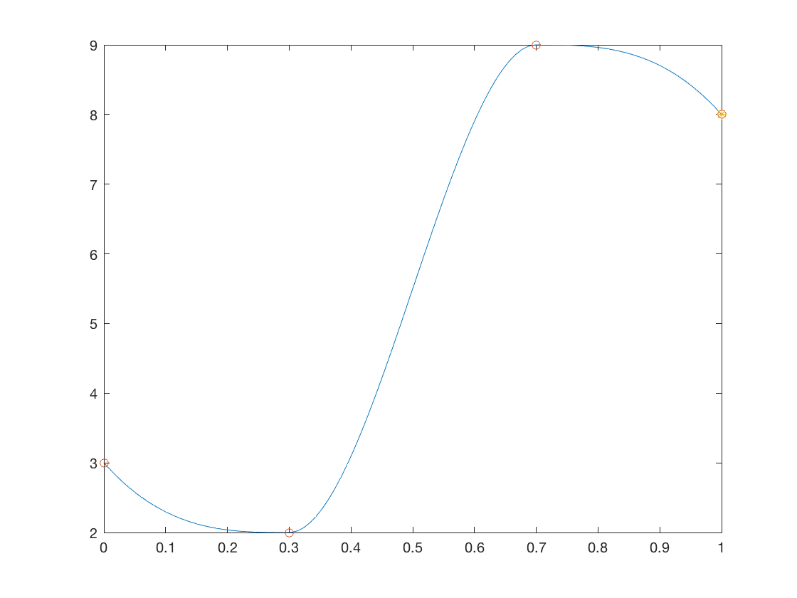

# README - Demo of GuiSliders


GuiSliders is a class that greatly simplifies development overhead associated with sliders. The class constructs a uipanel with a user-specified number of sliders. It automatically links editable text boxes to the slider value and bounds. All changes to the slider values are funneled up through a single event. The user need only define one event handler.


Michael R. Walker II 6/21/2017


## Contents


- Getting Started        
- Configure plotting object        
- Configure GUI Sliders        
- Link Sliders to Plotting Object

## Getting Started


A simple interpolation problem is used to demonstrate efficient plot update techniques. We define a class, ExamplePlotter, which services the plot updates and maintains copies of the associated plot handles. We then construct a GuiSliders panel in a separate figure. Finally we link the GuiSliders object to the ExamplePlotter object.


```matlab
clear;

% Reserve separate figures for plot and gui
figPlot = figure(1);
figPlot.Visible = 'off';
clf;
figGui = figure(3);
figGui.Visible = 'off';
clf;

% Initial control coordinates for interpolation.
% Note, we assume x(1) = 0, and x(end) = 1.
x23 = [.3 .7];
y = [3 2 9 8];
```


## Configure plotting object


Plotting will be handled by a separate object. Here we construct this object and draw the initial plot.


```matlab
% Make parent figure active
figure(figPlot);
% Setup control parameters
x0 = [x23,y];

hplotter = ExamplePlotter(x0);
```





## Configure GUI Sliders


Guisliders will be drawn in a separate figure. Here we construct the GuiSliders object and resize the figure window accordingly.


```matlab
figure(figGui); % Make parent figure active
bounds = [repmat([0.01 0.99],2,1); repmat([0,10],4,1)];
labels = {'x2','x3','y1','y2','y3','y4'};
hsliders = GuiSliders(x0,'bounds',bounds,'labels',labels);

% Remove most decorations &amp; shrink to panel size
set(figGui,'Name','GUI Sliders','NumberTitle','off',...
'DockControls','off','MenuBar','none','Resize','off');
figGui.Position(3:4) = hsliders.Position(3:4);
```


## Link Sliders to Plotting Object


Up until this point changes to the slider values did not affect the plot. The next step registers the callback handler from the plotter class to the GuiSliders object.


```matlab
addlistener(hsliders,'SliderUpdate',@hplotter.handleSliderUpdate);
```


<sub>[Published with MATLAB R2016b]("http://www.mathworks.com/products/matlab/")</sub>
